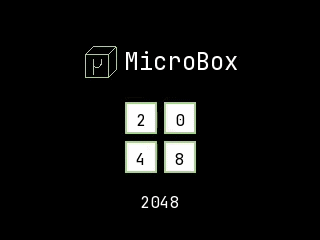
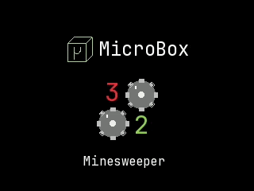
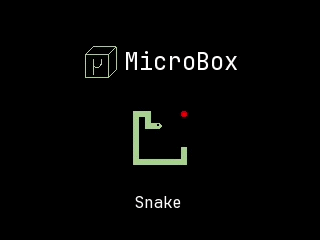
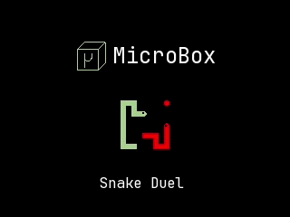
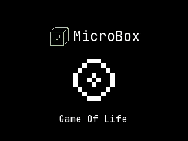
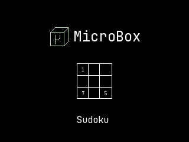

# [μ] MicroBox

MicroBox is a handheld game console built using microcontroller components and 3D printing.

All of the its code and [CAD files](docs/3d-printing.md) open-source. Follow the [DIY guide](docs/diy-guide.md) if you want to build your own.

## Featuring: **2048**, **Minesweeper**, **Game of Life**, **Snake**, **Sudoku**

You can see more screenshots from the games [here](docs/gameplay-overview.md).

If you want to try the games, you can use the [emulator](docs/emulator.md) and run games on your PC/laptop.

## [μ] MicroBox - Microcontroller Game Console System :video_game:

**MicroBox** is a custom game console system designed for **Arduino-compatible microcontrollers**
Currently we support [Arduino R4](https://store.arduino.cc/pages/uno-r4?utm_source=google&utm_medium=cpc&utm_campaign=EU-Pmax-Promo-UNOQ&gad_source=1&gad_campaignid=23949451143&gbraid=0AAAAACbEa86jbu5K_aK8YhOaAkHfuOvje&gclid=Cj0KCQjw3qLSBhDaARIsAFTiVh6PsJ9t0oZNf-3HO38Iwn47vgRDVPXCsDwB_7ZLmn2OcOjjYAtl91kaAnYSEALw_wcB) (both WiFi and Minima) and [Adafruit ESP32 Feather V2](https://learn.adafruit.com/adafruit-esp32-feather-v2/overview).

### Supported Hardware Configurations

**MicroBox 1**

- Microcontroller: [Arduino R4](https://store.arduino.cc/pages/uno-r4?utm_source=google&utm_medium=cpc&utm_campaign=EU-Pmax-Promo-UNOQ&gad_source=1&gad_campaignid=23949451143&gbraid=0AAAAACbEa86jbu5K_aK8YhOaAkHfuOvje&gclid=Cj0KCQjw3qLSBhDaARIsAFTiVh6PsJ9t0oZNf-3HO38Iwn47vgRDVPXCsDwB_7ZLmn2OcOjjYAtl91kaAnYSEALw_wcB) (both WiFi and Minima)
- Peripherals:
  - [1.69inch LCD Display Module](https://www.waveshare.com/1.69inch-lcd-module.htm?srsltid=AfmBOoq3-SJV-148pvUQOAuTN2pjNV6hhNaDa2fxkdd3ODQ0rUOmwW5t)
  - [DFRobot Input Shield for Arduino](https://www.dfrobot.com/product-62.html?gad_source=1&gad_campaignid=23447358446&gbraid=0AAAAADucPlCbsFsuHssSHAsHxhD_iGq0V&gclid=Cj0KCQjw3qLSBhDaARIsAFTiVh4YFCmpmH9g2alVPivpX_Kmecb7h24HF_MJJcAxdIv-WV6Tqtj5GXYaAj7_EALw_wcB)

**MicroBox 2**

- Microcontroller: [Adafruit ESP32 Feather V2](https://learn.adafruit.com/adafruit-esp32-feather-v2/overview)
- Peripherals:
  - [2.4inch LCD Display Module](https://www.waveshare.com/wiki/2.4inch_LCD_Module?srsltid=AfmBOoo17OiRTXlCW6H51OJOQeU2mw7jlKmeRFNPcaA_BcJgjijTmXbV)
  - [Adafruit Mini Gamepad](https://www.adafruit.com/product/5743?srsltid=AfmBOorsGx4R1TzJriEYoIZW9GdisQ2Tk5XiIi3y71QMWA4gCjC7bOeh)

## :sparkles: Showcase

Check out more pictures of the MicroBox case [here](docs/travel-case.md).

## :handshake: Contributing

Contributions are welcome!
If you have ideas for new games, optimizations, or hardware improvements, feel free to fork the repo, open a pull request, or contact me directly.

## :scroll: License

This project is released under the MIT License — free to use, modify, and share.

